# **Rapport S2.03**


## **`Index :`**

- ## [Semaine 6 : Début](#semaine-6--dc3a9but-1)

   - ### [1) Formation des équipes](#1-formation-des-c3a9quipes-1)

   - ### [2) Préparation d'une machine virtuelle](#2-prc3a9paration-dune-machine-virtuelle-1)

     - #### [2.1) Prérequis pour la machine](#21-prérequis-concernant-la-machine-physique)

     - #### [2.2) Création de la machine virtuelle](#22-création-machine-virtuelle)

     - #### [2.3) Installation de l'OS](#23-installation-de-los-1)

   - ### [3) Préparation du système](#3-prc3a9paration-du-systc3a8me-1)

     - #### [3.1) Accès sudo pour l'utilisateur](#31-accès-sudo-pour-user)

     - #### [3.2) Installation des suppléments invités](#32-installation-des-supplc3a9ments-invitc3a9s-1)

     - #### [3.3) Gestion du proxy](#33-précision-sur-le-proxy)

- ## [Semaine 7 : Balisage léger](#semaine-7--balisage-lc3a9ger-1)

   - ### [1) Les outils d'édition](#1-les-outils-dc3a9dition-1)

   - ### [2) Markdown](#2-markdown-1)

   - ### [3) Asciidoc](#3-asciidoc-1)

- ## [Semaine 9 : Installation Debian automatisée](#semaine-9--installation-debian-automatisc3a9e-1)

   - ### [1) A propos de Debian](#1-a-propos-de-debian-1)

     - #### [1.1) Documentations](#11-documentations-1)

     - #### [1.2) Questions](#questions--debian)

   - ### [2) Installation préconfigurée](#2-installation-prc3a9configurc3a9e-1)

- ## [Semaine 10 & 11 : Gitea](#semaine-10--11--gitea-1)

   - ### [1) Préliminaire](#1-prc3a9liminaire-1)

     - #### [1.1) Configuration globale de git](#11-configuration-globale-de-git-1)

     - #### [1.2) Accéder au port 3000](#12-accc3a9der-au-port-3000-1)

   - ### [2) Installation de Gitea](#2-installation-de-gitea-1)

     - #### [2.1) Installation de Gitea](#2-installation-de-gitea-1)

     - #### [2.2) Utilisation basique](#22-utilisation-basique-1)

<br>

--- 

## ***Semaine 6 : Début***

### **1) Formation des équipes**

> Utilisation du document `Nextcloud` sur le moodle pour s'inscrire en équipe de 3 personnes avant de 
commencer à réaliser le projet.

<br>

### **2) Préparation d'une machine virtuelle**

> Création d'une machine virtuelle `Debian 11` à partir du logiciel [Virtualbox](https://www.virtualbox.org) avec un environnement `MATE`
et 2 utilisateurs (_`root`_ et _`user`_) ainsi que quelque logiciels.

<br>

### 2.1) Prérequis concernant la machine physique

> + 4 Go de RAM minimum
>
> + 20 Go d’espace disque ou plus
>
> + [VirtualBox](https://www.virtualbox.org/wiki/Downloads) installé avec son «extension pack» (VBoxGuestAddition.iso) sur la machine hôte.

<br>

### 2.2) Création machine virtuelle

> Après avoir lancé Virtualbox, il faut en respectant les caractéristiques ci 
dessous : 
>
> + Nom de la machine dans VirtualBox : **sae203**
> + Dossier de la machine : **/usr/local/virtual_machine/infoetu/login**
>
> ##### Bien entendu, login est à remplacer par votre login.
>
> + Type : **Linux**
> + Version : **Debian** ou **Debian 11** en 64-bit
> + Mémoire vive (RAM) : **2048 Mo** pour être à l’aise à l’usage.
> + Disque dur : **20 Go** entier (une seule partition)
> + Laisser le reste par défaut.

<br>

>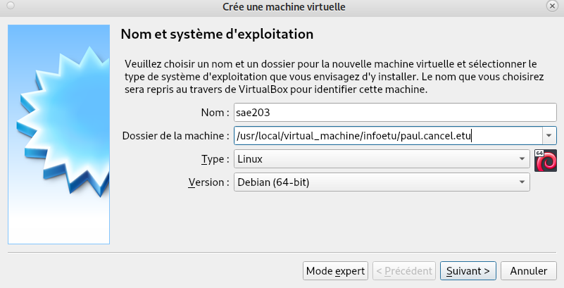
>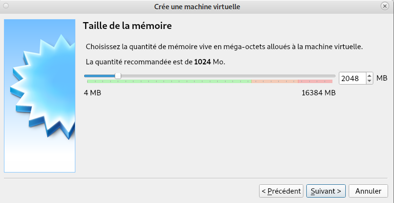
>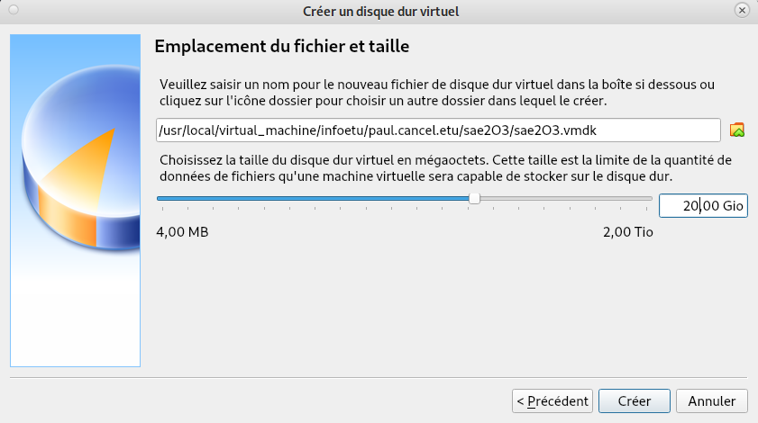

<br>

### **Questions : _Création machine virtuelle_**

####Que signifie “64-bit” dans “Debian 64-bit” ?

```

 Debian est codé sur Un processeur 64 bits est un microprocesseur dans lequelle 
 la taille d'un mot machine est de 64 bits.

```

[Différence entre 64 bits et 32 bits.](https://www.futura-sciences.com/tech/questions-reponses/processeur-sont-differences-processeurs-32-bits-64-bits-16516/)

####Quelle est la configuration réseau utilisée par défaut ?

```
C’est Dynamic Host Configuration Protocol (DHCP) qui est utilisée par défaut.
```


####Quel est le nom du fichier `XML` contenant la configuration de votre machine ?

```
Le nom du fichier XML contenant la configuration de la machine est sae203.vbox.
```

####Sauriez-vous modifier directement ce fichier pour mettre 2 processeurs à votre machine ?

```
Oui, il suffit de modifier la ligne CPU count à 2 dans le fichier XML de la machine.
```

<br>

### 2.3) Installation de l'`OS`

> Pour l'installation classique, on utilisera un fichier **iso bootable** d'une installation de "_Debian 11_" que l'on 
pourra retrouver sur le site officiel de [Debian](https://www.debian.org/) (_≈400Mo_).

<br>

> On va donc insérer le fichier `iso` d'installation dans le lecteur de la machine virtuelle déja disponible 
sur l'interface `Virtualbox`
>
>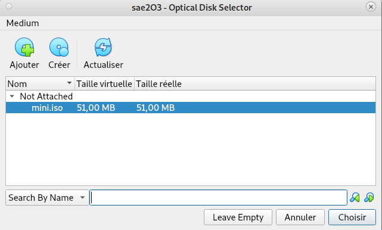

<br>

> Maintenant on allume la machine virtuelle et on commence l'installation en avec les informations
ci-dessous :

+ Nom de la machine (à l’installation) : **serveur**

+ Domaine : Laisser vide

+ Pays/langue : **France**

+ Miroir : **http://debian.polytech-lille.fr**

+ Proxy si nécessaire : **http://cache.univ-lille.fr:3128**

+ Compte administrateur : **root** / **root**

+ Un Compte utilisateur : **User** / **user** / **user**

+ Partition : 1 seule partition recouvrant le disque entier

+ Sélection des logiciels de démarrage (Paquetages logiciels à préinstaller pour se simplifier la vie par la
suite) :

  + environnement de bureau Debian

  + ... MATE (penser à décocher Gnome)

  + serveur _web_

  + serveur _ssh_

  + utilitaire usuels du système

<br>

>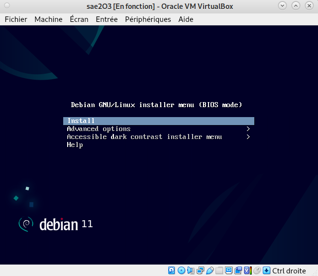
>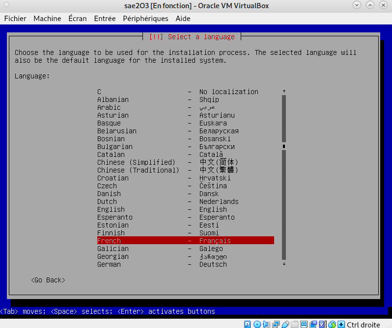
>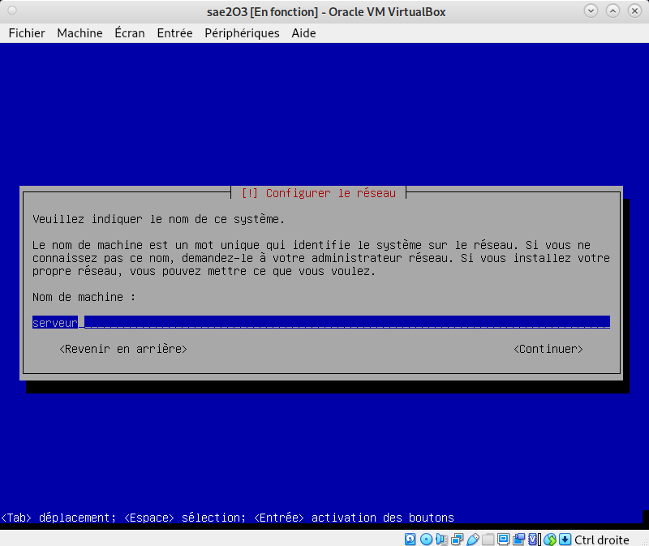
>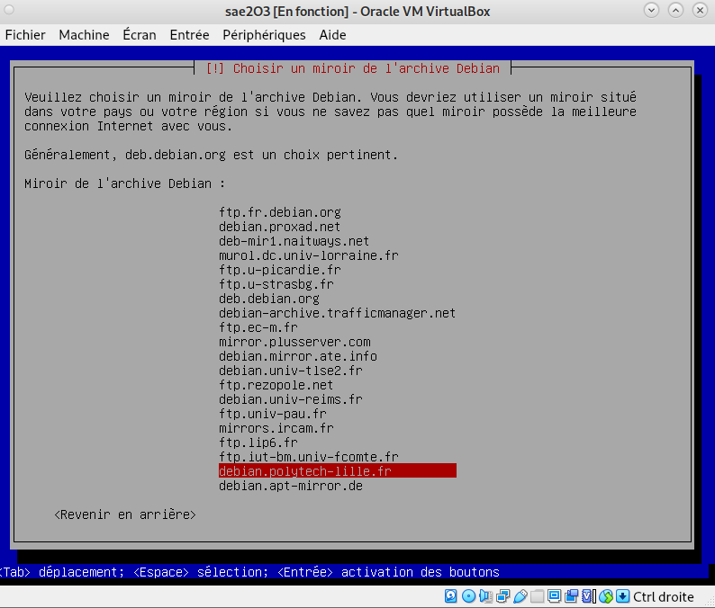
>

<br>

### **Questions : _Installation OS de base_**

####Qu’est-ce qu’un fichier `iso bootable` ?

```
Un fichier iso bootable agit comme un disque bootable mais pour une 
machine virtuelle pour installer l'OS. Avec la définition de bootable 
ci dessous.
```

[Définition bootable](https://www.futura-sciences.com/tech/definitions/informatique-bootable-18095/)

####Qu’est-ce que `MATE` ? `GNOME` ?

```
MATE est un fork de GNOME. Il fournit un environnement de bureau pour GNU/Linux 
et d'autres système d'exploitation proches d'Unix.
```
 : _logo de [MATE](https://wiki.debian.org/fr/MATE#:~:text=Qu'est%20ce%20que%20MATE,autres%20syst%C3%A8mes%20d'exploitations%20Unix.)_

####Qu’est-ce qu’un serveur web ?

```
Au niveau des composants matériels, un serveur web est un ordinateur qui stocke 
les fichiers qui composent un site web et qui les envoie à l'appareil de l'utilisateur 
qui visite le site.
```

####Qu’est-ce qu’un serveur `SSH` ?

```
SSH, ou Secure Socket Shell, est un protocole réseau qui permet aux administrateurs 
d'accéder à distance à un ordinateur. SSH désigne également l'ensemble des utilitaires qui 
mettent en oeuvre le protocole.
```

[Définition de SSH](https://fr.wikipedia.org/wiki/Secure_Shell)

####Qu’est-ce qu’un serveur mandataire ?

```
Un serveur mandataire est un programme qui joue le rôle d'intermédiaire entre un 
ordinateur et un réseau. Il transfère la demande de votre ordinateur vers le site cible 
en utilisant sa propre adresse IP.
```

<br>

### **3) Préparation du système**

> Nous allons maintenant préparer le système pour faciliter l'utilisation de la machine virtuelle.

<br>

### 3.1) Accès [sudo](https://fr.wikipedia.org/wiki/Sudo) pour _user_

> + On commence par passer en mode console avec la séquence de touche **Ctrl** + **Alt** + **F1**
>
> + On se connecte en tant que **root** : `login` = **root** `password` = **root**
>
> + On entre la commande "_`usermod -aG sudo user`_" pour ajouter les droits `sudo` à user

<br>

### **Questions : _sudo_**

#### Comment peux-ton savoir à quels groupes appartient l’utilisateur user ?

```
Il faut utiliser la commande "groups user" pour voir les groupes dont user fait partie,
y compris le groupe sudo.
```

> 

<br>

### 3.2) Installation des suppléments invités

> Maintenant nous allons ajouter les suppléments invités à notre machine virtuelle.
>
> 1. On insère le cd des suppléments : 
>
>     **`Périphériques > Insérer l'image des CD des additions invité`**
>
>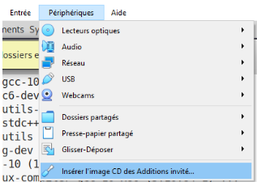
>
> 2. On monte le CD avec la commande suivante :
>
>     **`sudo mount /dev/cdrom /mnt`**
>
> 3. On installe les suppléments avec la commande suivante :
>
>     **`sudo /mnt/VBoxLinuxAdditions.run`**
>
> 4. On relance la machine puis on se connecte à _`user`_.

<br>

### **Questions : _Suppléments invités_**

#### Quel est la version du noyau Linux utilisé par votre VM ? 

```
Avec la commande “cat /proc/version” on obtient 5.10.0-21-amd64.
```

#### À quoi servent les suppléments invités ? Donner 2 principales raisons de les installer.

```
Les additions invité sont une collection de pilotes de périphériques et d'applications 
système pour VirtualBox qui améliorent les performances du système d'exploitation 
invité et permettent une meilleure interaction entre la machine hôte et la machine invité.
```

#### À quoi sert la commande `mount` (dans notre cas de figure et dans le cas général) ?

```
La commande "mount" sert à monter le disques dur, dans notre cas, cela sert à lancer 
VBoxLinuxAdditions.run pour les suppléments invité.
```

>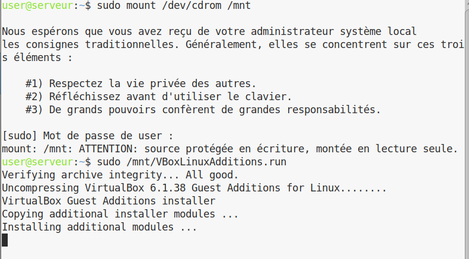

### 3.3) Précision sur le Proxy

> Un "_`proxy`_" ou "_`serveur mandataire`_" est un serveur relais, qui joue le rôle d'intermédiaire entre deux hôtes sur Internet.
> 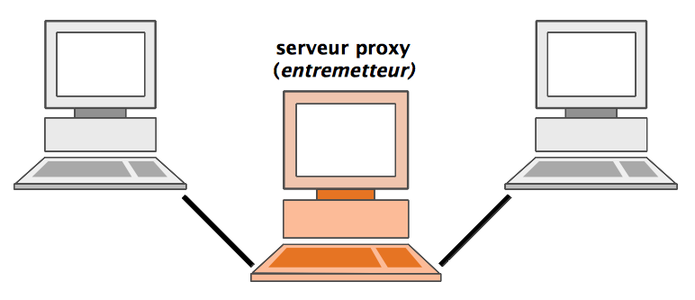
>
> Au sein de l'université il faut utiliser un proxy pour pouvoir accéder à internet depuis la machine
virtuelle. En l'occurence le proxy pourr _`http`_ et _`https`_ pour l'université est 
"**`http://cache.univ-lille.fr:3128`**".
>
> Pour configurer le proxy dans le Terminal : 

```
export http_proxy=http://cache.univ-lille.fr:3128
export https_proxy=$http_proxy
```

> Si on veut éviter de devoir le reconfigurer à chaque fois qu'on **relance un terminal** on peut mettre ces 
2 lignes dans le fichier **`$HOME/.bashrc`**.
>
> Pour **désactiver** le proxy on peut utiliser la commande : **`unset http_proxy`**
>
> On peut également configurer le proxy via l'interface **`MATE`** dans :
>
>"**`Système › Préférences › Internet et réseau › Serveur mandataire`**"
> puis on y mets la même URL pour HTTP et HTTPS.

<br>

---

## ***Semaine 7 : Balisage léger***

> ## **Résumé :**
>
> Quelques liens pour apprendre à utiliser [Markdown](https://fr.wikipedia.org/wiki/Markdown) et [Asciidoc](https://fr.wikipedia.org/wiki/AsciiDoc), ainsi que les exportations
vers d'autres formats avec des outils tels que **pandoc** (docx, pdf, html...).

<br>

### **1) Les outils d'édition**

> On peut utiliser un simple éditeur de texte.
>
> On fera les conversions avec les outils :

+ **`pandoc`** (pour Markdown)

+ **`asciidoctor`** & **`asciidoctor-pdf`** (pour Asciidoc).

> Un simple terminal et la bonne commande en ligne de commande seront suffisant pour générer le
rapports.
>
> On peut également utiliser des éditeurs en lignes tels que [stackedit](https://stackedit.io/) ou [dillinger](https://dillinger.io/) pour **Markdown**
> ou encore [AsciidocLive](https://asciidoclive.com/) pour **Asciidoc**.

<br>

### **2) Markdown**

> [Markdown](https://daringfireball.net/projects/markdown/) est un format texte à balisage léger créé parr Jhon Gruber et Aaron Schwartz 
(http://www.aaronsw.com/) en 2004.
>
> L'outil initial est en lui même parfois assez **limité** et c'est pourquoi il existe de nombreuses **extensions**
telles que :

+ **`Pandoc`** : [Pandoc's Markdown](https://pandoc.org/MANUAL.html#pandocs-markdown)

+ **`PHP Markdown Extra`** : [PHP Markdown Extra](https://michelf.ca/projects/php-markdown/extra/)

+ `Le service` **`github`** : [Github syntax](https://docs.github.com/fr/get-started/writing-on-github/getting-started-with-writing-and-formatting-on-github/basic-writing-and-formatting-syntax)

+ `Le service` **`gitlab`** : [Gitlab syntax](https://docs.gitlab.com/ee/user/markdown.html)

+ `Le groupe` **`CommonMark`** : [CommonMark](https://commonmark.org/)

> Toutes ces pages sont utiles pour comprendre et réussir à utiliser l'outil **Markdown**

<br>

### **3) Asciidoc**

> [Asciidoc](https://asciidoc.org/) est un format similaire à **Markdown** créé par **Stuart Rackham** en 2002. Il possède également plus de fonctionnalités que Markdown.
>
> _Comparatif Asciidoc / Markdown :_

+ https://docs.asciidoctor.org/asciidoc/latest/asciidoc-vs-markdown/

+ https://asciidoc.org/#compare

> Le convertisseur [Asciidoctor](https://asciidoctor.org/) est le _convertisseur_ à utiliser pour convertir le format 
**Asciidoc** (_.adoc_) en **html**.
> Et [Asciidoctor-pdf](https://docs.asciidoctor.org/pdf-converter/latest/) est celui à utiliser pour les conversion en pdf.
>
> Comme **Asciidoc** est plus complet que **Markdown** il n'y aura pas besoin d'extensions comme **pandoc**
pour faire un rapport.

<br>

---

## ***Semaine 9 : Installation Debian automatisée***

### **1) A propos de Debian**

> 

<br>

### 1.1) Documentations

La distribution Debian propose une [documentation](https://www.debian.org/doc/) très complète au travers de son guide utilisateur,
traduit dans de nombreuses langues.

### **Questions : Debian**


#### 1. Qu’est-ce que le Projet Debian ? D’où vient le nom Debian ?

```
Le projet Debian est une association d'individus qui ont pour 
cause commune de créer un système d'exploitation libre.
Le nom Debian est tiré du créateur Ian Murdock et de son épouse
Debra Murdock. (Deb+Ian)
```

> ## Ian Murdock : 
>
> 

[Sources 1](https://www.debian.org/intro/about)

<br>

#### 2. Il existe 3 durées de prise en charge (support) de ces versions : 

```
La durée minimale, la durée en support long terme (LTS) et la durée en support long terme étendue (ELTS).
Quelle sont les durées de ces prises en charge ?

La durée minimale est de 2 ans, celle du support long terme LTS est 5 ans et 
celle étendue est de 5 ans de plus donc 10 ans.
```

[Sources 2](https://wiki.debian.org/fr/LTS/Extended)

<br>

#### 3. Pendant combien de temps les mises à jour de sécurité seront-elles fournies ?

```
Les mises à jour de sécurité seront encore fournie une année après que la version
stable suivante soit publiée.
```

[Sources 3](https://www.debian.org/security/faq.fr.html#lifespan)

<br>

#### 4. Combien de version au minimum sont activement maintenues par Debian ?Donnez leur nom générique.

```
Debian a toujours au moins trois versions activement entretenues : "stable", "testing" et "unstable". 

"Bullseye", "Bookworm" et "Sid".
```

[Sources 4](https://www.debian.org/releases/index.fr.html)

<br>

#### 5. Chaque distribution majeur possède un nom de code différent. Par exemple, la version majeur actuelle (Debian 11) se nomme Bullseye. D’où viennent les noms de code données aux distributions ?

```
Les noms des versions de Debian viennent d'une inspiration des films d'animations Pixar.
En effet Bullseye est le nom du cheval de Woody dans Toy Story 2.
```

> ## Bullseye : 
>
> 

[Sources 5](https://www.debian.org/doc/manuals/project-history/releases.fr.html)

<br>

#### 6. L’un des atouts de Debian fut le nombre d’architecture (≈ processeurs) officiellement prises en charge. Combien et lesquelles sont prises en charge par la version Bullseye ?

```
Il y a 8 architectures qui sont prises en charges par Debian : AMD64 & Intel 64, Intel x86-based,
ARM, ARM avec matériel FPU, ARM 64 bits, MIPS 64 bits (petit-boutien), MIPS 32 bits (petit-boutien),
Power Systems, IBM S/390 64 bits.
```

[Sources 6](https://www.debian.org/releases/stable/arm64/ch02s01.fr.html)

<br>

#### 7. Première version avec un nom de code  : 

```
- Quelle a était le premier nom de code utilisé ?
    Le premier nom de code était Buzz.
- Quand a-t-il été annoncé ?
    Le 17 juin 1996.
- Quelle était le numéro de version de cette distribution ?
    Debian 1.1
```

[Sources 7](https://www.debian.org/doc/manuals/project-history/releases.fr.html)

<br>

#### 8. Dernière nom de code attribué : 

```
- Quel est le dernier nom de code annoncé à ce jour ?
    Le dernier nom de code annoncé est Bullseye
- Quand a-t-il été annoncé ?
    Le 14 août 2021.
- Quelle est la version de cette distribution ?
    Debian 11.0
```

[Sources 8](https://www.debian.org/doc/manuals/project-history/releases.fr.html)

<br>

### **2) Installation préconfigurée**

> Même si il existe sur l'image **`iso`** que nous avons déja utilisé une option avancée pour automatiser 
l'installation, celle ci reste limitée puisqu'elle entre uniquement les options par défaut.
>
> 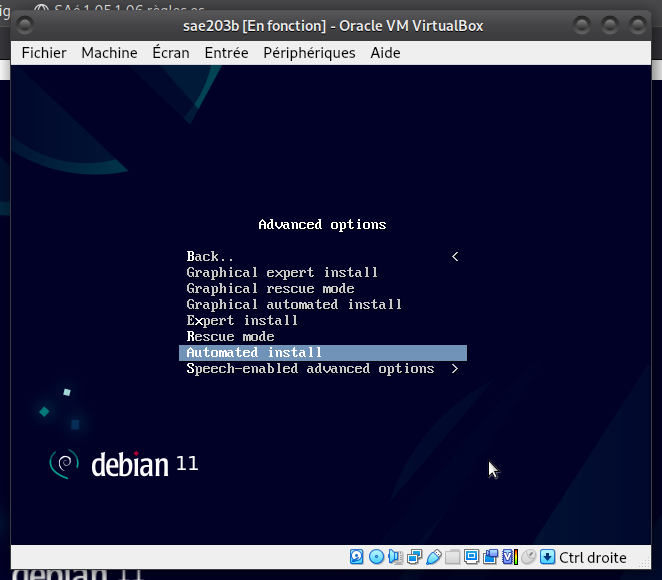

<br>

> Si nous voulons utiliser des paramètres **différents** de ceux de bases il faudra que nous utilisions un 
fichier _`.viso`_ personnalisé avec les options que l'on veut avoir.
>
> On va maintenant procéder à la création d'une **nouvelle** machine qu'on appellera **`sae203b`** 
via l'interface Virtualbox.

<br>

> On insèrera le fichier "**`SAE203-Debian.viso`**" dans le lecteur optique de la machine virtuelle avec les 
paramètres que nous avons de base dans l'archive "**`autoinstall.zip`**" disponible sur le moodle.
>
> Pour éditer les **paramètres de préconfiguration**, nous irons mofidier le fichier "**`preseed.cfg`**" qui liste 
l'ensemble des informations et actions à faire automatiquement lors de l'installation.

> _Fichiers de pré-configuration_ 
+ On récupère l'archive "**`autoinstall.zip`**" sur le moodle et on la décompresse dans le répertoire 
**`/usr/local/virtualmachine/infoetu/_login_/sae203b`**
en remplaçant _login_ par notre login.

+ On se place dans le **répertoire** puis on éxécute cette **commande** : 

```
sed -i -E "s/(--iprt-iso-maker-file-marker-bourne-sh).*$/\1=$(cat
/proc/sys/kernel/random/uuid)/" S203-Debian11.viso
```

+ On insère le fichier **`viso`** dans le **lecteur** de la machine virtuelle

> 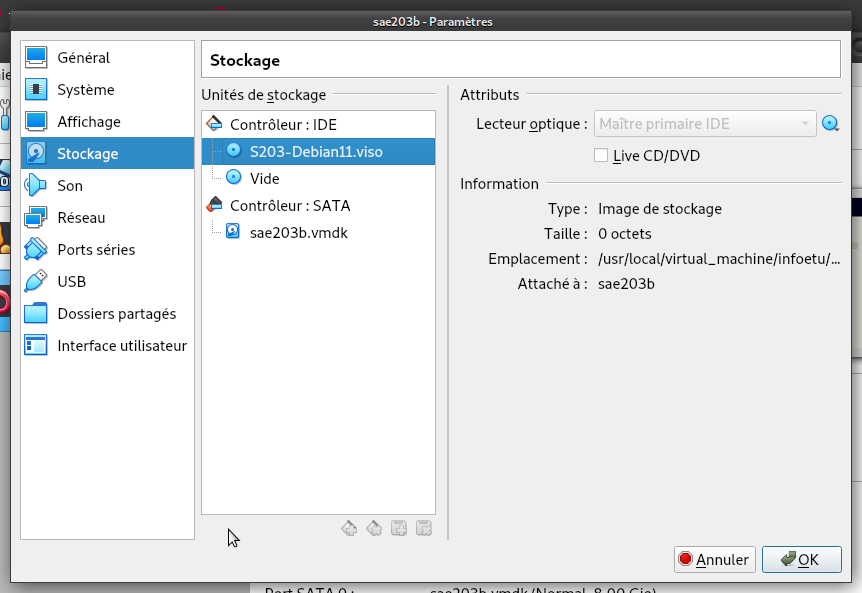

<br>

+ On **démarre** la machine virtuelle et on **attend** que l'installation se termine (_≈5-10min_) 

> 

<br>

> On obtient une installation sans **interface graphique**. 
Ce que la commande [tasksel](https://doc.ubuntu-fr.org/tasksel) pourrait corriger mais ce ne serait pas **100% automatisé**.

### **Questions : Pré-Installation**

#### Ajustement de la pré-configuration : 

> + Ajouter le droits `sudo` à _`user`_
>
> + Installer l'environnement `MATE`
>
> + Installer les paquets : `sudo`, `git`, `sqlite3`, `curl`, `bash-completion`, `neofetch`.

> On rajoute **`mate-desktop`** dans la partie tasksel du preseed.
>
> 
>
> Et on rajoute ces lignes en bas du fichier de preseed. 
>
> 

<br>

--- 

## ***Semaine 10 & 11 : Gitea***

<br>

### **1) Préliminaire**

> Nous considérons que les étapes précédentes sont réalisées. Nous avons donc une machine virtuelle avec
une **`Debian 11.6`** avec au moins **`mate-desktop`**, **`git`**, et **`sqlite3`** installés (et quelques autres paquets).

### 1.1) Configuration globale de git

> Nous allons maintenant configurer quelque paramètres pour le logiciel **`git`**
>
> On éxécute les commandes suivante dans un terminal (en remplaçant les informations évidemment) :

```
git config --global user.name "Prénom Nom" 
git config --global user.email "votre@email" 
git config --global init.defaultBranch "master" 

```

> On éxécute ensuite cette commande pour installer le paquet **`git-gui`** :

```
sudo apt install git-gui
```

### **Questions : Préliminaire**

#### Qu’est-ce que le logiciel **`git-gui`** ? Comment se lance-t-il ?

```
Git Gui est l'interface graphique d'un outil en ligne de commande. De ce fait, toutes 
les possibilités offertes par Git ne sont pas disponibles dans Git Gui.
On peut l'executer avec la commande "git gui &"
```

> 

#### Qu’est-ce que le logiciel **`gitk`** ? Comment se lance-t-il ?

```
gitk est un navigateur de dépôt graphique, le premier de son genre. Il peut être
considéré comme un encapsuleur graphique pour git log. 
Il permet d'explorer et de visualiser l'historique d'un dépôt.
Il est écrit en tcl/tk, ce qui le rend portable sur tous les
systèmes d'exploitation.
On peut y accéder en tapant "gitk &" dans le terminal.
```

> 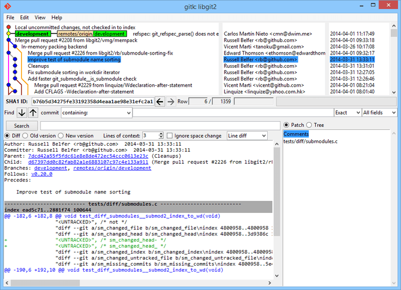

#### Quelle sera la ligne de commande `git` pour utiliser par défaut le `proxy de l’université` sur tous vos projets git ?

```
git config --global http.proxy http://cache.univ-lille.fr:3128
```

<br>

### 1.2) Accéder au `port 3000`

> Avant de se lancer dans l’installation de **`Gitea`** proprement dites, vous aurez besoin d’ouvrir des ports
> d’accès sur votre machine virtuelle.
>
> Le service Gitea est un service web et utilise par défaut sur le **`port 3000`** de la machine sur lequel il est
> démarré. Il n’est donc pas nécessaire d’être root pour le démarrer (_mais il faut être root pour l’installer_).

> Le mode réseau par défaut de notre machine virtuelle est le mode **`NAT`**. Il permet de faire la redirection
dont nous avons besoins ici.
> On modifiera donc comme ci dessous dans 
>
> "**`Virtualbox > Paramètres > Réseau > Mode d'accès réseau : NAT > Avancé`**"
>
> 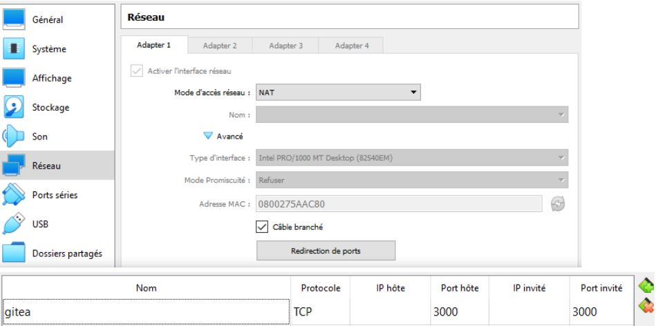

<br>

### **2) Installation de [Gitea](https://gitea.io/)**

> 

<br>

### **Questions : **Gitea****

<br>

#### Qu’est-ce que `Gitea` ?

```
Gitea est une forge logicielle libre en Go sous licence MIT, pour l'hébergement
de développement logiciel, basé sur le logiciel de gestion de versions Git pour
la gestion du code source.
```

#### À quels logiciels bien connus dans ce domaine peut-on le comparer (en citer au moins 2) ?

```
On peut le comparer à Github et à Gitlab notamment.
```

[Github](https://github.com/) / [Gitlab](https://about.gitlab.com/)

> Vu qu'il n'existe pas de paquet Debian pour l'installation de Gitea, l'installation sera légèrement plus 
compliquée que pour d'autres paquets. 
Néanmoins l'installation reste simple si on suit correctement la [documentation](https://docs.gitea.io/).

<br>

> Dans l'ordre, nous allons donc : 

+ **`Téléchargement`**
    + Exécuter la commande : 

```
wget -O gitea https://dl.gitea.com/gitea/1.18.5/gitea-1.18.5-linux-amd64
chmod +x gitea
```

<br>

+ **`Mise en fonctionnement`** 

    + Télécharger la [clé](https://keys.openpgp.org/search?q=teabot%40gitea.io) avant d'éxécuter la commande : 

```
gpg --keyserver keys.openpgp.org --recv 7C9E68152594688862D62AF62D9AE806EC1592E2
gpg --verify gitea-1.18.5-linux-amd64.asc gitea-1.18.5-linux-amd64
```
 
+ + Ajouter un utilisateur destiné à utiliser Gitea avec : 

```
adduser \
    --system \
    --shell /bin/bash \
    --gecos 'Git Version Control' \
    --group \
    --disabled-password \
    --home /home/git \
git
```

+ + Générer la structure des dossiers nécessaire avec :

```
mkdir -p /var/lib/gitea/{custom,data,log}
chown -R git:git /var/lib/gitea/
chmod -R 750 /var/lib/gitea/
mkdir /etc/gitea
chown root:git /etc/gitea
chmod 770 /etc/gitea
```

+ + Copier le fichier binaire au bon endroit :

```
cp gitea /usr/local/bin/gitea
```

+ **`Lancement de Gitea`**

  + Pour activer gitea au lancemement :

```
sudo systemctl enable gitea
sudo systemctl start gitea
```

> Pour vérifier le fonctionnement de **gitea** on utilise "_`systemctl status gitea.service`_"
>
> Après avoir visité "http://localhost:3000", on crée l'utilisateur "gitea" sur la page.
>
> 
>
> On **complète** ensuite la configuration sur la page [Localhost](http://localhost:3000) avec les informations suivantes : 

+ La **base de données** sera `SQLite3` ;

+ Le **compte administrateur web** sera :

  + **Nom** : `gitea`

  + **Password** : `gitea`

  + **Email** : `git@localhost`
  
> 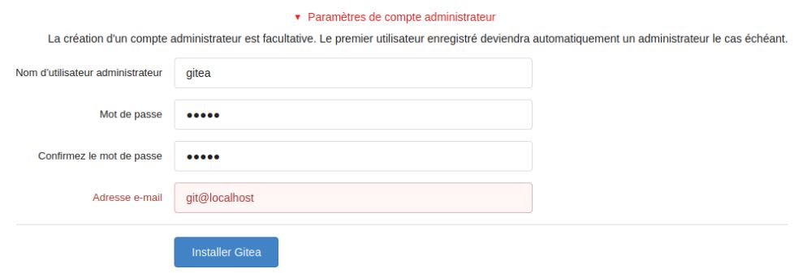

<br>

### **Questions : Mise à jour**

#### Comment faire pour la **mettre à jour** sans devoir tout reconfigurer ?

```
Il faut utiliser "systemctl restart gitea".
```

<br>

### 2.2) Utilisation basique

### Commandes pour réaliser l'ajouts de plusieurs **projets** : 

+ Un projets directement créé depuis l'interface web de Gitea : 
    
```
On utilise simplement le bouton "upload" sur l'interface de Gitea et on sélectionne le 
fichier
```

+ Nos rapports sur cette Sae : 

```
git init (dans le dossier courant)
git checkout -b main
git add README.md
git commit -m "first commit"
git remote add origin http://localhost:3000/gitea/RapportsSAE.git
git push -u origin main
git add *
git commit -m "second commit"
git push -u origin main 
```

+ Les codes sources de TP et Projets dans les ressources de développement :

```
Normalement cela serait les même commandes que pour les rapports mais en 
l'occurence ces fichiers sont déja dans un dépôt git avec une association avec
Gitlab et donc cela engendrerait un conflit. 
```

### **Questions : Projets existants**

#### Que se passe-t-il ? Qu’elle semble en être la cause ? Comment corriger ce problème ?

```
Une erreur se produit et un conflit entre Gitlab et Gitea semble en être la cause. 
```

---

<br>

<br>

<br>

<br>

##### **CANCEL Paul - LEROY Quentin - LABBE Julien**

<br>

##### [Retour à l'index](#)